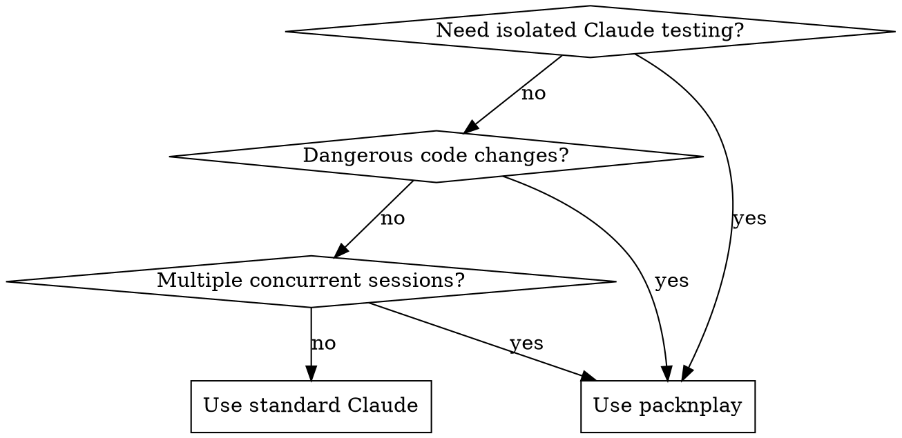

# Isolated Claude Testing

Run Claude Code in isolated Docker containers using packnplay for safe, sandboxed testing.

## Overview

**packnplay** is a containerization wrapper for AI coding agents that provides:
- **Sandboxed execution** in isolated Docker containers
- **Automatic worktree management** for parallel branch testing
- **Smart credential handling** with macOS Keychain integration
- **Multiple AI agent support** (Claude, Codex, Gemini, Copilot, etc.)

**Core principle:** Test dangerous changes or different API configurations in isolated environments without affecting your host system.

## When to Use



**Use cases:**
- Sandboxed testing of dangerous code changes
- Multiple concurrent Claude sessions (different branches/features)
- Port forwarding for web server testing
- Testing with different API endpoints/configurations
- Clean environment evaluation

**Don't use for:**
- Simple local development (standard Claude is faster)
- Non-isolated testing scenarios

## Core Concepts

### Container Isolation
Each Claude session runs in a separate Docker container with:
- **Independent filesystem** - changes don't affect host
- **Isolated environment** - clean state for each test
- **Host path preservation** - project mounted at same path as host

### Worktree Management
```bash
# Worktrees stored at: ~/.local/share/packnplay/worktrees/<project>/<worktree>

# Auto-create: current branch name becomes worktree name
packnplay run claude  # Creates worktree for current branch

# Explicit: create or connect to specific worktree
packnplay run --worktree=feature-auth claude

# Skip: use current directory without worktree
packnplay run --no-worktree claude
```

**Benefits:**
- Test multiple branches simultaneously
- No context switching between features
- Isolated build artifacts and dependencies

### Credential Mounting
Credentials are mounted **read-only** for security:
- `~/.gitconfig` - git user configuration
- `~/.ssh` - SSH keys for authentication
- `~/.config/gh` - GitHub CLI credentials
- `~/.gnupg` - GPG keys for commit signing

**macOS Keychain Integration:** Claude and GitHub credentials auto-extracted and copied (not mounted) to avoid file lock conflicts.

## Quick Reference

| Task | Command |
|------|---------|
| Install (Homebrew) | `brew install obra/tap/packnplay` |
| Install (Go) | `go install github.com/obra/packnplay@latest` |
| Run Claude | `packnplay run claude` |
| With worktree | `packnplay run --worktree=feature-branch claude` |
| Port mapping | `packnplay run -p 3000:3000 claude` |
| With credentials | `packnplay run --ssh-creds --gh-creds claude` |
| With env config | `packnplay run --config=z.ai claude` |
| List containers | `packnplay list` |
| Attach to container | `packnplay attach --worktree=feature-branch` |
| Stop container | `packnplay stop --worktree=<name>` |
| Stop all | `packnplay stop --all` |
| Reconfigure | `packnplay configure` |

## Installation

**Homebrew (recommended):**
```bash
brew install obra/tap/packnplay
```

**Go install:**
```bash
go install github.com/obra/packnplay@latest
```

**Requirements:**
- Docker Desktop (macOS) or Docker Engine (Linux) running
- Git (for worktree functionality)

**Verify Docker is running:**
```bash
docker info  # Should show Docker system info
docker ps    # Should list running containers (may be empty)
```

## First Run Setup

On first run, packnplay prompts interactive credential setup:

```bash
packnplay run claude
# → Interactive UI appears: select which credentials to mount
# → Choices saved to ~/.config/packnplay/config.json
```

## Common Operations

### Basic Usage

```bash
# Run Claude with auto worktree (uses current branch name)
packnplay run claude

# Use specific worktree (creates if needed, connects if exists)
packnplay run --worktree=feature-auth claude

# Skip worktree, use current directory
packnplay run --no-worktree claude

# Get shell in container
packnplay run bash
```

### Credential Management

```bash
# Enable specific credentials per-run
packnplay run --git-creds claude          # Mount ~/.gitconfig
packnplay run --ssh-creds claude          # Mount ~/.ssh
packnplay run --gh-creds claude           # Mount GitHub CLI credentials
packnplay run --gpg-creds claude          # Mount GPG keys for signing
packnplay run --npm-creds claude          # Mount npm credentials
packnplay run --aws-creds claude          # Mount AWS credentials
packnplay run --all-creds claude          # Mount all available
```

**macOS Keychain Integration:** Claude and GitHub CLI credentials auto-extracted from Keychain.

### Environment Configurations

Switch between different API setups:

```bash
# Use specific env config (defined in ~/.config/packnplay/config.json)
packnplay run --config=z.ai claude
packnplay run --config=anthropic-work claude
```

**Config file structure:**
```json
{
  "env_configs": {
    "z.ai": {
      "name": "Z.AI Claude",
      "description": "Z.AI's Claude with GLM models",
      "env_vars": {
        "ANTHROPIC_AUTH_TOKEN": "${Z_AI_API_KEY}",
        "ANTHROPIC_BASE_URL": "https://api.z.ai/api/anthropic",
        "ANTHROPIC_DEFAULT_MODEL": "GLM-4.6"
      }
    }
  }
}
```

### Container Lifecycle

```bash
# List running containers
packnplay list

# Attach to running container (runs postAttachCommand)
packnplay attach --worktree=feature-branch

# Stop specific container
packnplay stop --worktree=feature-branch

# Stop all packnplay containers
packnplay stop --all
```

**Auto-attach:** Running `packnplay run` again for existing worktree connects to running container.

### Port Mapping

```bash
# Single port (host:container)
packnplay run -p 8080:3000 claude

# Multiple ports
packnplay run -p 3000:3000 -p 8080:8080 claude

# Bind to specific IP
packnplay run -p 127.0.0.1:8080:3000 claude

# With protocol
packnplay run -p 8080:3000/tcp -p 5353:53/udp claude
```

## Web Server Testing Example

```bash
# Terminal 1: Start Claude with port mapping
packnplay run -p 3000:3000 claude

# Inside container: Start dev server
cd /path/to/project
npm run dev

# Terminal 2 (host): Access server
curl http://localhost:3000
# Or open in browser
```

**Port conflicts:**
```bash
# Find what's using the port
lsof -i :3000

# Use alternate port
packnplay run -p 3001:3000 claude
```

## Environment Variables

```bash
# Set specific variable
packnplay run --env DEBUG=1 claude

# Pass through from host
packnplay run --env EDITOR claude

# Multiple variables
packnplay run --env DEBUG=1 --env EDITOR --env NODE_ENV=test claude
```

**Safe whitelist:** Only `TERM`, `LANG`, `LC_*`, `COLORTERM` passed from host by default.

## Reconfiguration

```bash
# Interactive configuration (safe, preserves custom settings)
packnplay configure
```

Safe editing benefits:
- Preserves custom settings not shown in UI
- Shows current values as defaults
- No data loss from manual edits

## Default Container

**Image:** `ghcr.io/obra/packnplay/devcontainer:latest`

**Includes:**
- Languages: Node.js LTS, Python 3.11+, Go latest, Rust latest
- Cloud CLIs: AWS, Azure, Google Cloud, GitHub
- AI Agents: claude, opencode, codex, gemini, copilot, qwen, amp, deepseek
- Tools: Git, vim, nano, jq, yq, curl, wget, make
- Shell: Zsh with oh-my-zsh

## Supported AI Agents

Packnplay supports 7 major AI coding assistants:

| Agent | Command | Config Mount |
|-------|---------|--------------|
| Claude Code | `claude` | `.claude/` |
| OpenCode AI | `opencode` | `.config/opencode/` |
| OpenAI Codex | `codex` | Auto API vars |
| Google Gemini | `gemini` | Auto API vars |
| GitHub Copilot | `copilot` | Auto auth |
| Qwen Code | `qwen` | Auto API vars |
| Sourcegraph Amp | `amp` | Auto API vars |

## AWS Credentials

Intelligent AWS credential handling:

```bash
# With AWS SSO profile
export AWS_PROFILE=my-profile
packnplay run --aws-creds aws s3 ls

# With static credentials
export AWS_ACCESS_KEY_ID=AKIA...
export AWS_SECRET_ACCESS_KEY=...
packnplay run --aws-creds aws s3 ls

# Override per-invocation
packnplay run --aws-creds --env AWS_REGION=eu-west-1 aws ec2 describe-instances
```

**Supported tools:** AWS SSO, granted.dev, aws-vault, any `credential_process` tool.

## Common Pitfalls

| Mistake | Why It Happens | Fix |
|---------|----------------|-----|
| Forgetting `--worktree` flag | Expected to reuse existing worktree | Use `--worktree=<name>` explicitly |
| Port syntax confusion | Mixes up host:container order | Remember: `-p HOST:CONTAINER` (host first) |
| Credentials not working | Default config doesn't include them | Use `--all-creds` or specific flag like `--ssh-creds` |
| Container starts but fails | Docker image outdated or wrong | Run `packnplay refresh-container` |
| Multiple containers conflict | Using same worktree name | Use unique `--worktree` names |
| Git operations fail | `.git` not mounted correctly | Check worktree exists: `git worktree list` |
| Permission denied inside container | User detection failed | Check devcontainer.json `remoteUser` field |

## Security Considerations

### Credential Handling
- **Read-only mounts**: Credentials mounted read-only when possible
- **No persistence**: Credentials exist only while container runs
- **Keychain integration**: macOS credentials copied, not mounted (avoids file locks)

### Container Isolation
- **Filesystem changes**: Container writes are discarded on stop
- **Network access**: Container has full network access (same as host)
- **Process isolation**: Container processes isolated from host

### Best Practices
- **Don't use `--all-creds`** unless needed - reduce credential exposure
- **Review `env_configs`** before committing - may contain API keys
- **Stop containers after use**: `packnplay stop --all` cleans up resources
- **Check mounted paths**: Verify only necessary credentials are mounted

## Troubleshooting

| Issue | Solution |
|-------|----------|
| Container not starting | `docker info` to verify Docker running |
| Auth errors | Check `ANTHROPIC_API_KEY` is set, use `--config` for custom endpoints |
| Port conflicts | `lsof -i :3000` to find conflicts, use alternate port `-p 3001:3000` |
| Worktree issues | Check `git worktree list`, use `--no-worktree` to skip |
| Permission denied | Verify user detection: check devcontainer.json `remoteUser` |
| Credentials not mounted | Run `packnplay configure`, check `~/.config/packnplay/config.json` |
| Old container image | `packnplay refresh-container` to update default image |

## Worktree Management

**Location:** `~/.local/share/packnplay/worktrees/<project>/<worktree>`

**Auto-create:** Current branch name used as worktree name when no `--worktree` flag.

**Git integration:** Main repo `.git` mounted, so git commands work correctly.
