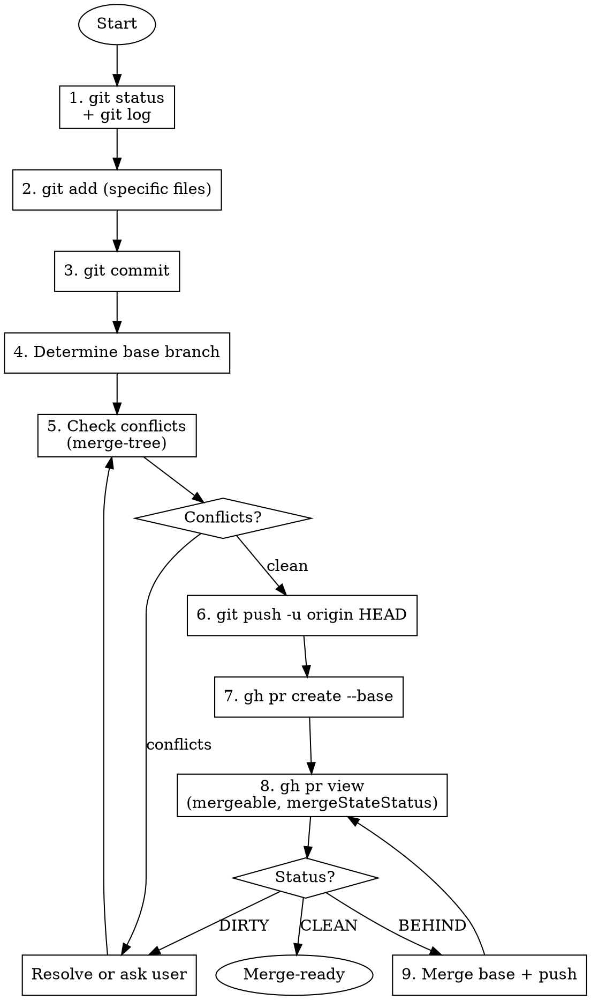

# Create PR

Complete git workflow from commit to merge-ready PR.

**Core principle**: Verify before every transition—commit→push, push→PR, PR→merge-ready.

## When to Use

Use when user says:
- "Create PR" / "Make PR" / "Open PR"
- "Commit and push"
- "Push this"
- "Ready to merge"

Do NOT use when:
- User only wants to commit (not push)
- Changes not ready (tests failing, WIP)

## Workflow Overview



## Red Flags - STOP

Stop if:
- You don't know which base branch to use
- You skipped conflict check before push
- You used `git add` without first running `git status`
- You created PR but didn't check status afterward
- You stopped at PR creation without verifying merge-ready
- You said "GitHub will notify" or "CI will catch it"
- You said "just pushed so base hasn't changed"

**All of these mean: Follow complete workflow.**

## Quick Reference

| Step | Command | Notes |
|------|---------|-------|
| Status | `git status && git log --oneline -5` | Always first |
| Add | `git add path/to/file` | Specific files only |
| Commit | `git commit -m "type: description"` | Conventional commits |
| Base branch | `gh repo view --json defaultBranchRef -q .defaultBranchRef.name` | Never assume |
| Conflict check | `git fetch origin <base> && git merge-tree $(git merge-base HEAD origin/<base>) HEAD origin/<base>` | Exit 0 = clean |
| Push | `git push -u origin HEAD` | After conflict check |
| Create PR | `gh pr create --base <base> --title "..." --body "..."` | Always `--base` |
| PR status | `gh pr view --json mergeable,mergeStateStatus` | CLEAN/BEHIND/DIRTY |
| Update branch | `git merge origin/<base> --no-edit && git push` | When BEHIND |

## Key Decision Points

### Base Branch Detection
1. `gh repo view --json defaultBranchRef` (primary)
2. `gh pr list --limit 1 --json baseRefName` (existing PRs)
3. Ask user if unclear

### Conflict Resolution
**Auto-resolve**: Whitespace, non-overlapping imports, independent additions
**Ask user**: Logic conflicts, 3+ files, unclear which version

### PR Status Actions
- **CLEAN**: Merge-ready
- **BEHIND**: `git merge origin/<base> --no-edit && git push`, then re-check
- **DIRTY**: Resolve conflicts, then re-check

## PR Body Template

```markdown
## Summary
- Bullet list of changes (from commits)

## Test plan
- [ ] Tests pass
- [ ] Manual verification done
```

## Common Mistakes

| Mistake | Fix |
|---------|-----|
| Omit `--base` flag | Always specify explicitly |
| `git add -A` blindly | Run `git status` first |
| Skip conflict check before push | Always check before push |
| Assume base branch | Verify via `gh repo view` |
| Stop after PR creation | Check status and update branch |
| Assume merge-ready | Verify mergeStateStatus |

## Rationalization Table

| Excuse | Reality |
|--------|---------|
| "PR created, done" | Created ≠ merge-ready. Check status. |
| "GitHub will notify" | Be proactive. Check now. |
| "Just pushed, base unchanged" | Base can update anytime. Always check. |
| "CI will catch it" | CI runs after merge-ready. Verify first. |
| "Too complex to auto-resolve" | Try auto-resolution first. Ask if fails. |

## Arguments

Supported flags (passed after `/create-pr`):
- `--base <branch>`: Override base branch detection
- `--draft`: Create draft PR
- `--automerge`: Enable auto-merge after creation

Example: `/create-pr --base develop --draft`
