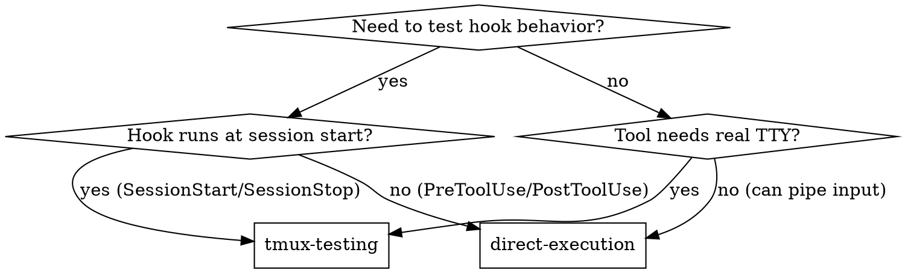

# tmux Testing

## Overview

Use tmux to create isolated terminal sessions for testing interactive CLI tools and hooks that only run at session start. This enables automated testing of SessionStart hooks, verification of real TTY behavior, and repeated testing without manual intervention.

## CRITICAL Requirements

**MUST do for every tmux test:**

1. **ALWAYS use trap cleanup** - Without trap, failed tests leave zombie sessions
   ```bash
   trap "tmux kill-session -t '$SESSION_NAME' 2>/dev/null || true" EXIT
   ```

2. **ALWAYS use `-d` flag** - Without `-d`, session blocks your terminal
   ```bash
   tmux new-session -d -s "$SESSION_NAME"  # NOT tmux new-session -s "$SESSION_NAME"
   ```

3. **ALWAYS use unique session names** - Without uniqueness, concurrent tests collide
   ```bash
   SESSION_NAME="test-$$-$RANDOM"  # NOT SESSION_NAME="test"
   ```

4. **PREFER polling over sleep** - Fixed delays create slow/flaky tests
   ```bash
   wait_for_output "$SESSION_NAME" "expected" 5  # NOT sleep 5
   ```

**Violating any of these WILL cause problems.**

## When to Use



**Use when:**
- Testing SessionStart hooks (only execute once at session start)
- Testing SessionStop hooks (only execute once at session end)
- Interactive CLI tools require real TTY (trust prompts, confirmations)
- Need to verify behavior in FRESH Claude Code session
- Current session already has hook state (can't re-test)

**Don't use when:**
- Testing PreToolUse/PostToolUse hooks (test with direct execution)
- Testing commands/agents/skills (use Claude Code directly)
- Simple bash scripts (test with direct execution)
- CI/CD without tmux installed (use BATS + direct execution)

## Core Pattern

**Before (manual testing):**
```bash
# Slow, tedious, can't automate
claude
# manually respond to prompts
# manually verify results
# repeat for each test
```

**After (tmux automation):**
```bash
# Fast, automated, repeatable
tmux new-session -d -s "test-$$"
tmux send-keys -t "test-$$" "claude" C-m
tmux capture-pane -t "test-$$" -p
tmux kill-session -t "test-$$"
```

## Quick Reference

| Operation | Command | Purpose |
|-----------|---------|---------|
| Create session | `tmux new-session -d -s "name"` | Start detached session |
| Send keys | `tmux send-keys -t "name" "cmd" C-m` | Simulate keyboard input |
| Capture output | `tmux capture-pane -t "name" -p` | Get screen contents |
| Kill session | `tmux kill-session -t "name"` | Cleanup session |
| List sessions | `tmux list-sessions` | See all sessions |
| Attach session | `tmux attach-session -t "name"` | Interact directly |

**Key sequences:**
- `C-m` = Enter key
- `C-c` = Ctrl+C (interrupt)
- `C-d` = Ctrl+D (EOF)

## Anti-Patterns

| Anti-Pattern | Why It's Wrong | Correct Approach |
|--------------|----------------|------------------|
| `sleep 5` to wait | Too short = race conditions, too long = slow tests | Use `wait_for_output` function |
| `SESSION_NAME="test"` | Concurrent tests collide | `SESSION_NAME="test-$$-$RANDOM"` |
| No trap cleanup | Zombie sessions accumulate on failure | `trap "tmux kill-session..." EXIT` |
| `tmux new-session -s name` | Blocks automation (no `-d` flag) | `tmux new-session -d -s name` |
| Ignoring trust prompt | Session hangs at Claude Code trust prompt | Send `yes` after starting Claude Code |
| Hardcoded paths | Test not portable | Use `$PROJECT_ROOT` or relative paths |

**Remember:** Every anti-pattern above causes real problems. Don't "optimize later."

## Implementation

### Helper Function: Polling

**REQUIRED:** Include this function in all tmux tests. Replace ALL `sleep` calls with polling.

```bash
#!/bin/bash
# Wait for specific output instead of fixed delay
wait_for_output() {
    local session="$1"
    local expected="$2"
    local timeout="${3:-10}"
    local elapsed=0

    while [ $elapsed -lt $timeout ]; do
        OUTPUT=$(tmux capture-pane -t "$session" -p)
        if echo "$OUTPUT" | grep -q "$expected"; then
            return 0
        fi
        sleep 0.5
        elapsed=$((elapsed + 1))
    done

    echo "Timeout waiting for: $expected" >&2
    echo "Last output:" >&2
    tmux capture-pane -t "$session" -p >&2
    return 1
}
```

### Basic Session Lifecycle

```bash
#!/bin/bash
set -euo pipefail

SESSION_NAME="test-$$-$RANDOM"

# Cleanup trap
trap "tmux kill-session -t '$SESSION_NAME' 2>/dev/null || true" EXIT

# 1. Create detached session
tmux new-session -d -s "$SESSION_NAME" -x 80 -y 24

# 2. Send command
tmux send-keys -t "$SESSION_NAME" "your-command" C-m

# 3. Wait for execution
# NOTE: For simple cases, brief sleep is acceptable. Use wait_for_output for reliability.
sleep 1

# 4. Capture output
OUTPUT=$(tmux capture-pane -t "$SESSION_NAME" -p -S -50)
echo "$OUTPUT"

# 5. Verify results
if echo "$OUTPUT" | grep -q "expected-text"; then
    echo "✅ Test passed"
else
    echo "❌ Test failed"
    exit 1
fi
```

### Testing SessionStart Hooks

**IMPORTANT:** Claude Code requires trust prompt response. Session will hang without it.

```bash
#!/bin/bash
set -euo pipefail

SESSION_NAME="sessionstart-test-$$-$RANDOM"
ENV_FILE="/tmp/test-env-$$"
PROJECT_ROOT="/path/to/project"

trap "tmux kill-session -t '$SESSION_NAME' 2>/dev/null || true" EXIT

# Setup
export CLAUDE_ENV_FILE="$ENV_FILE"
rm -f "$ENV_FILE"

# Include wait_for_output function (see Helper Function section)
source /path/to/wait_for_output.sh

# Start Claude Code in tmux
tmux new-session -d -s "$SESSION_NAME" -x 100 -y 30
tmux send-keys -t "$SESSION_NAME" "cd $PROJECT_ROOT" C-m

# Start Claude Code and wait for trust prompt
tmux send-keys -t "$SESSION_NAME" "claude" C-m
wait_for_output "$SESSION_NAME" "Yes, proceed" 10

# Respond to trust prompt
tmux send-keys -t "$SESSION_NAME" C-m  # Select "Yes"
wait_for_output "$SESSION_NAME" "glm-4.7" 10  # Session started

# Verify SessionStart hook executed
if grep -q "STRATEGIC_COMPACT_SESSION_ID" "$ENV_FILE"; then
    echo "✅ SessionStart hook executed"
else
    echo "❌ SessionStart hook did not execute"
    echo "ENV_FILE contents:"
    cat "$ENV_FILE" 2>/dev/null || echo "(file not found)"
    exit 1
fi
```

**Trust Prompt Handling:**
- Always wait for "Yes, proceed" or "Do you trust" before sending "yes"
- Claude Code may show trust prompt on FIRST run or after updates
- Without trust response, session hangs indefinitely

### Interactive Verification

**Use this for manual testing and debugging.** Creates a persistent session you can attach to.

```bash
#!/bin/bash
SESSION_NAME="interactive-test-$$-$RANDOM"
PROJECT_ROOT="/path/to/project"

# Create session with proper terminal size
tmux new-session -d -s "$SESSION_NAME" -x 100 -y 30
tmux send-keys -t "$SESSION_NAME" "cd $PROJECT_ROOT" C-m
tmux send-keys -t "$SESSION_NAME" "export COMPACT_THRESHOLD=3" C-m
tmux send-keys -t "$SESSION_NAME" "claude" C-m

# Wait and respond to trust prompt
sleep 2  # Initial wait for Claude Code to start
tmux capture-pane -t "$SESSION_NAME" -p | grep -q "trust" && \
    tmux send-keys -t "$SESSION_NAME" C-m

# Show current state
echo "=== Current Session State ==="
tmux capture-pane -t "$SESSION_NAME" -p | tail -20

# Instructions for manual interaction
cat << 'EOF'
Session ready! To interact manually:
  tmux attach-session -t SESSION_NAME  # Replace with actual session name

To detach (keep running):
  Press Ctrl+B, then D

To kill session when done:
  tmux kill-session -t SESSION_NAME  # Replace with actual session name
EOF
```

## Common Mistakes

| Mistake | Problem | Fix |
|---------|---------|-----|
| Not using `-d` flag | Session attaches to current terminal, blocking automation | Always use `-d` for detached sessions |
| Forgetting trap | Sessions accumulate on failures | `trap "tmux kill-session -t 'name'" EXIT` |
| Using `sleep` blindly | Too short = race conditions, too long = slow tests | Use polling or condition-based waiting |
| Not trusting trust prompt | Session hangs at trust prompt | Send "yes" after Claude Code starts |
| Hardcoding session names | Concurrent tests collide | Use `test-$$-$RANDOM` |
| Not setting terminal size | Default size may break layout | Use `-x 80 -y 24` or similar |
| Capturing too little output | Missing verification data | Use `-S -50` to capture more lines |

## CI/CD Considerations

**tmux may not be available in CI:**

```bash
@test "SessionStart hook integration" {
    if ! command -v tmux &>/dev/null; then
        skip "tmux not available - run locally"
    fi

    # tmux test here
}
```

**Headless CI requirements:**
- Set `DISPLAY=:99` (Xvfb for GUI apps)
- Set `TMUX_TMPDIR=/tmp`
- May need `TERM=xterm-256color`

## Red Flags - Wrong Tool

**STOP and reconsider if:**
- You're testing PreToolUse hooks → Use direct execution instead
- You're testing non-interactive scripts → Use BATS instead
- You need this in CI without tmux → Skip or use alternative
- You're just running bash commands → Use direct execution

**tmux adds complexity.** Only use it when you genuinely need:
- Real TTY
- Session isolation
- Interactive input automation
- Fresh session state

## Real-World Impact

**Before tmux-testing:**
- SessionStart hook testing required manual session restart
- Each test iteration took 2+ minutes of manual work
- Developers skipped testing or did it manually once
- Bugs in SessionStart hooks reached production

**After tmux-testing:**
- SessionStart hooks tested automatically
- Test iterations take seconds
- Tests run on every change
- Hooks verified before commit

**Example:** strategic-compact plugin SessionStart hook verified in seconds vs minutes of manual testing.

## Comparison with Alternatives

| Tool | Pros | Cons | Best For |
|------|------|-------|----------|
| **tmux** | Real TTY, easy debug, simple Bash | Requires installation | Interactive CLI testing |
| **expect** | Pre-installed, mature | Complex Tcl syntax, harder to debug | Legacy automation |
| **screen** | Similar to tmux | Less active development | tmux unavailable |
| **BATS only** | Fast, CI-friendly | No real TTY, no session isolation | Unit tests |

**Recommendation:** Use tmux for interactive testing, BATS for unit tests.
